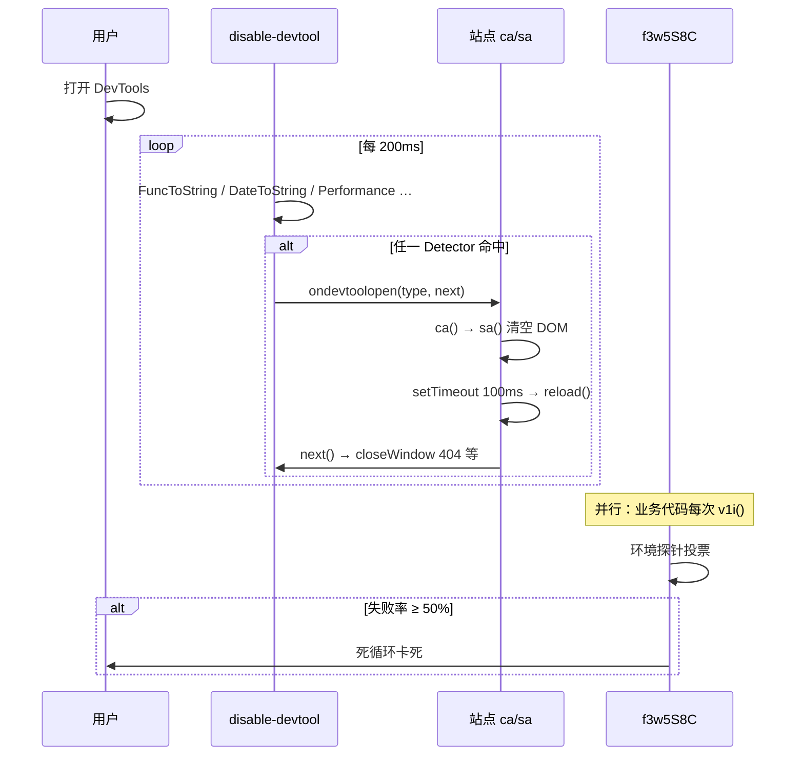
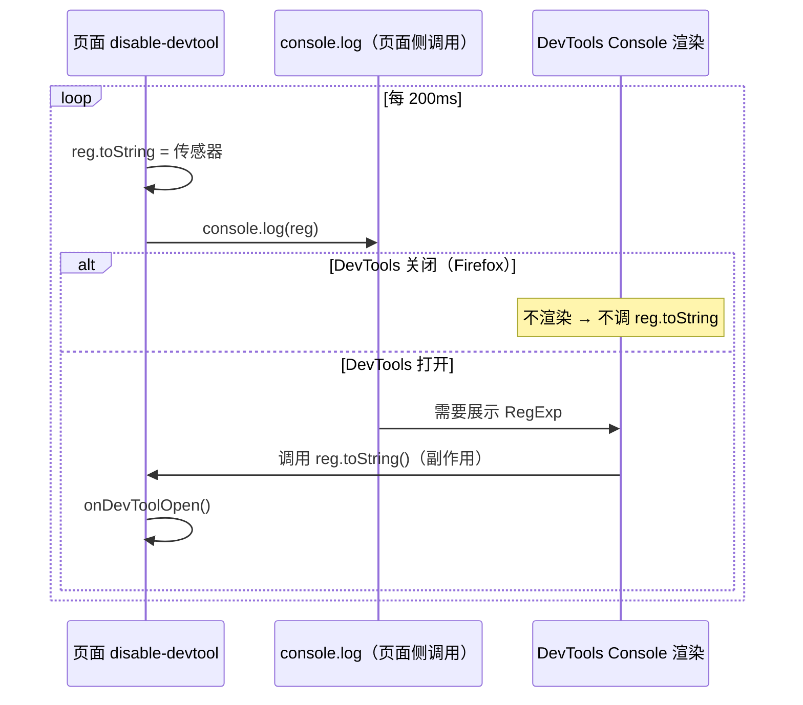
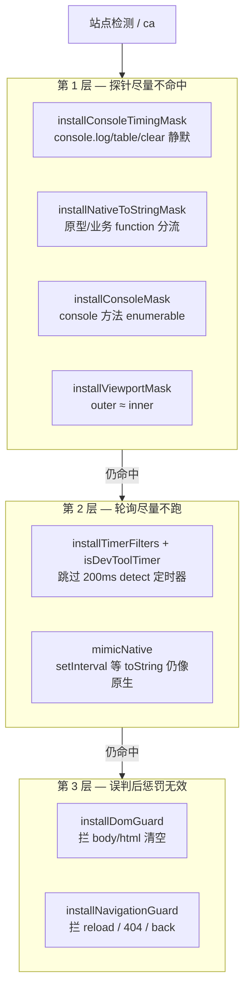
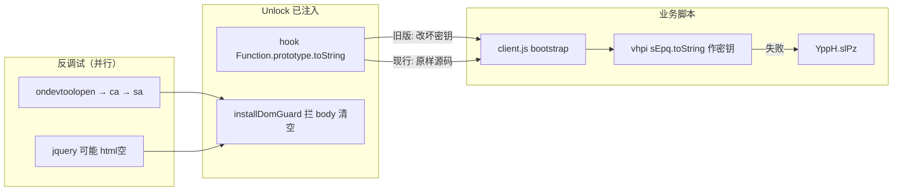

# **如何强制调试一个不让调试网站**

> 中文文档 · [English](./force-debug-blocked-sites.md)


## 背景

在调试 [AnimeKai 播放页](https://anikai.watch/one-piece-episode-1164-in-english-subbed/) 时，打开 Chrome DevTools 会触发反调试：页面闪白、强制刷新，或跳转 disable-devtool 官方 404。站点主 bundle `scripts-CbWe9mAN.js` 内嵌了 [disable-devtool](https://github.com/theajack/disable-devtool) 并在其之上叠加了自定义检测，因此无法常规审查网络请求与播放器逻辑。

本文记录 **如何从源码认出这些检测**，以及如何用 **DevTools Unlock** 扩展在 `document_start` 逐点绕过。

## 本文结构

1. **§一 现象** — 不可调试时你会看到什么  
2. **§二 源码侦察** — 如何从 bundle 确认 disable-devtool + 站点自定义层  
3. **§三–§五 架构与原理** — 四层检测分别做什么（库 + 站点加码）  
4. **§六 对抗方案** — Unlock 对照表与例（**§6.3**）  
5. **§七–§十一** — MV3 注入、安装验证、局限与参考  

---

## 一、现象：网站不可调试时发生什么

在 AnimeKai 等使用同类反调试栈的站点上，典型表现如下（细节见 **§5.2**、**§5.7**）：

| 时机 | 用户可见现象 | 背后逻辑 |
|------|--------------|----------|
| 按 F12 打开 DevTools | 页面**闪白**（内容瞬间消失） | `sa()` 清空 `body` / `documentElement`（**§5.2**） |
| 闪白后约 100ms | **无限刷新**或卡在空白页 | `ca()` → `setTimeout(100ms)` → `location.reload()` |
| 部分路径 | 跳转到 `theajack.github.io/disable-devtool/404.html?h=…` | disable-devtool 默认 `closeWindow`（**§5.3**） |
| 安装扩展但 hook 不当 | **一加载就惩罚**，与是否开 DevTools 无关 | 启动 `native code` 自检（**§5.4**） |
| 环境指纹投票失败 | 页面**卡死**（无刷新，标签页无响应） | `f3w5S8C` 死循环（**§5.5**） |

若尚未安装 Unlock，往往来不及在 Network / Sources 里定位脚本；**§二** 说明如何在不依赖 DevTools 的前提下拿到 bundle 并确认检测类型。

---

## 二、从网站源码如何识别

### 2.1 拿到主 bundle

1. 打开目标页（如 AnimeKai 播放页），DevTools → **Network** → 筛选 **JS**。  
2. 找**体积最大**、在 HTML `<script>` 里最早加载的主脚本；本案例为 `scripts-CbWe9mAN.js`（hash 随构建变化，文件名模式多为 `scripts-*.js`）。  
3. 若一打开 DevTools 就触发 **§一** 中的刷新，可先：**禁用 JavaScript** 后刷新并保存 JS；或用 **curl / wget** 抓 HTML 与脚本 URL；或在惩罚前用 **Save Page As** 存本地再分析。

样本已保存在 [`analysis/scripts-CbWe9mAN.js`](../analysis/scripts-CbWe9mAN.js)，来源为 anikai.watch 主 bundle。

### 2.2 确认 disable-devtool 的指纹

在 bundle 全文搜索（或反混淆后搜索）以下特征：

| 搜索关键词 / 特征 | 说明 | 详见 |
|-------------------|------|------|
| `theajack.github.io/disable-devtool` | 库默认 `closeWindow` 的 404 跳转 URL | **§5.3** |
| `ondevtoolopen` / `rewriteHTML` / `interval` | 初始化配置对象字段 | **§5.1** |
| `isDevToolOpened` / `clearLog` / `DetectorType` | 库内轮询与检测器枚举 | **§4.1–4.2** |
| `console.log` + 自定义 `toString` 计数 | DateToString / FuncToString 探针 | **§4.2** |
| `console.table` 与 `console.log` 耗时对比 | Performance 探针（Chrome 桌面） | **§4.2** |

命中 `theajack` + `ondevtoolopen` 即可认定：**站点打包进了 disable-devtool**，而非自研一套完全独立的检测库。

### 2.3 确认站点自定义层

| 搜索关键词 / 特征 | 对应检测 | 详见 |
|-------------------|----------|------|
| `document.documentElement.innerHTML = ""` 与 `reload` 同链 | `ca()` / `sa()` 惩罚链 | **§5.2** |
| `native code` + `setInterval` / `setTimeout` / `addEventListener` | 启动自检：API 被 hook 即惩罚 | **§5.4** |
| `f3w5S8C` / `v1i` / `A7u` | 混淆层完整性投票 | **§5.5** |
| `app_version` + `localStorage` | 环境篡改探针 | **§5.6** |
| `//# sourceMappingURL` 周期性注入 | 调试环境探测 | **§5.6** |

自定义层与库**并行**：即使 disable-devtool 未命中，启动自检或 `f3w5S8C` 仍可能单独触发惩罚。

### 2.4 反混淆与提取产物

站点字符串经 `r.q71(N)` / `r.u46(N)` 混淆，建议按以下顺序深入：

| 产物 | 路径 | 用途 |
|------|------|------|
| 原始 bundle | `analysis/scripts-CbWe9mAN.js` | 搜索指纹、对比构建 |
| 字符串反混淆 | `analysis/scripts-CbWe9mAN.deobfuscated.js` | 8291 处明文，便于搜 `ondevtoolopen` / `ca` |
| 反调试可读摘要 | `analysis/scripts-CbWe9mAN.anti-devtool.extract.js` | 仅保留 disable-devtool 相关链 |
| webcrack 格式化 | `analysis/deobfuscated-webcrack/deobfuscated.js` | 控制流可读性更好 |
| 业务样本 | `analysis/client.js` | `YppH.slPz` / `fn.toString()` 解密密钥（检测点 **U**，**§6.3.8**） |

### 2.5 侦察结论一览

将 **§2.2–2.3** 指纹映射到 bundle 四层结构，便于进入 **§三** 架构图：

| 侦察指纹 | bundle 层 | 章节 |
|----------|-----------|------|
| `f3w5S8C` / `v1i` / console 枚举 | ① 混淆壳 | **§5.5** |
| `ondevtoolopen` / `DetectorType` / 200ms 轮询 | ② disable-devtool | **§四**、**§5.1** |
| `ca()` / `sa()` / `native code` / `app_version` | ③ 站点自定义惩罚层 | **§5.2–5.6** |
| `client.js` / 播放器 / pjax | ④ 业务代码 | **§6.3.8**（**U**） |

---

## 三、整体架构

以下为 **§二 侦察结论** 的可视化：主 bundle 内四层检测与业务代码的关系。

```
┌──────────────────────────────────────────────────────────────────┐
│  scripts-CbWe9mAN.js                                              │
├──────────────────────────────────────────────────────────────────┤
│  ① 混淆壳（约 1–2157 行）                                         │
│     f3w5S8C — 环境完整性投票，失败 ≥50% → 死循环                   │
│     经 r.v1i() / r.A7u() 在业务代码中高频调用                      │
├──────────────────────────────────────────────────────────────────┤
│  ② disable-devtool 库（theajack，打包进 bundle）                   │
│     每 200ms 跑一轮 Detector，任一命中 → ondevtoolopen             │
├──────────────────────────────────────────────────────────────────┤
│  ③ 站点自定义惩罚层                                               │
│     ca() / sa() / native code 自检 / app_version 探针             │
├──────────────────────────────────────────────────────────────────┤
│  ④ 业务代码（pjax、播放器、广告…）                                 │
└──────────────────────────────────────────────────────────────────┘
                              ↑
         DevTools Unlock 在 ②③ 运行之前注入 unlock.js（MAIN world）
```

字符串在源码里被 `r.q71(N)` / `r.u46(N)` 混淆；反混淆版见 `analysis/scripts-CbWe9mAN.deobfuscated.js`，摘要见 `analysis/scripts-CbWe9mAN.anti-devtool.extract.js`。

---

## 四、disable-devtool 官方库：检测原理

> 仓库：[theajack/disable-devtool](https://github.com/theajack/disable-devtool)  
> 默认 `interval: 200`（文档 3.1.2），站点 bundle 同样使用 **200ms**。  
> 在 **§二** 确认库身份后，对照本节 Detector 理解 **§三** 架构图中的 **②**。

### 4.1 总体调度

库初始化后做三件事：

```text
DisableDevtool(options)
  ├── initInterval()     → setInterval(每 interval ms 跑所有 Detector)
  ├── disableKeyAndMenu() → 禁 F12 / Ctrl+Shift+I / 右键菜单（站点设 disableMenu: false 则不禁）
  └── initDetectors()    → 按 detectors 数组实例化各检测器
```

每一轮轮询（`src/utils/interval.ts`）：

```text
for (每个已注册 Detector) {
  clearDevToolOpenState(detector.type)   // 先清零
  detector.detect()                      // 执行检测，命中则 markDevToolOpenState
}
clearLog()                               // 可选：清空 console
checkOnDevClose()                        // 若 DevTools 关闭，调 ondevtoolclose
```

`isDevToolOpened()` 遍历各 Detector 的打开状态，**任一仍为 true** 即认为 DevTools 打开，触发 `ondevtoolopen(type, next)`。  
`type` 为 `DetectorType` 枚举，标识是哪种探针命中。

默认 `ondevtoolopen` 为 `closeWindow()`（`src/utils/close-window.ts`）：

1. 若配置了 `url` → `location.href = url`  
2. 否则 `rewriteHTML` 覆写页面  
3. 否则 `window.open('','_self')` + `window.close()` + `history.back()`  
4. 500ms 后仍失败 → 跳转 `timeOutUrl` 或官方 404：  
   `https://theajack.github.io/disable-devtool/404.html?h=${encodeURIComponent(location.host)}`

### 4.2 八种 DetectorType 详解

官方枚举（`DetectorType`）与 **检测原理**、**典型生效环境**：

| Type | 名称 | 检测原理（为何 DevTools 打开会暴露） | Chrome 桌面 | Firefox | 移动 |
|------|------|--------------------------------------|:-----------:|:-------:|:----:|
| **0** | `RegToString` | 给 `RegExp` 实例挂自定义 `toString`；每轮 `console.log(reg)`。**DevTools 打开时**会额外调用 `toString`（Firefox 立即判定；QQ 浏览器用 100ms 内连续两次判定） | — | ✓ | — |
| **1** | `DefineId` | 用 `Object.defineProperty` 在 DOM/对象上埋 getter/id，DevTools 检查元素时会触发异常访问模式 | ✓ | ✓ | ✓ |
| **2** | `Size` | `outerWidth - innerWidth` 或 `outerHeight - innerHeight` 超过阈值（DevTools  dock 会占宽度/高度）。**v0.3.5 起默认关闭**（易误伤） | 可选 | 可选 | — |
| **3** | `DateToString` | 给 `Date` 挂自定义 `toString`，每轮 `console.log(date)` 并 `clearLog()`；DevTools 为渲染对象会 **多次调用 `toString`**，计数 ≥2 判定打开 | ✓ | ✓ | — |
| **4** | `FuncToString` | 与 Date 相同思路，对象换成 `function(){}`；`console.log(fn)` 触发 toString 计数 | ✓ | ✓ | — |
| **5** | `Debugger` | 执行 `(function(){ debugger; })()`，用前后时间差；**DevTools 打开且暂停在 debugger 时**耗时 >100ms | — | — | iOS Chrome |
| **6** | `Performance` | 构造大对象数组，分别测 `console.table(arr)` 与 `console.log(arr)` 耗时；**DevTools 打开时** console 需要格式化/渲染，`table` 相对 `log` 的耗时比会异常（约 10 倍以上，且连续 2 次） | ✓ | — | — |
| **7** | `DebugLib` | 检测页面上是否存在 eruda、**vConsole**（如 `#__vconsole.vc-toggle`）等第三方调试 UI | ✓ | ✓ | ✓ |

**Chrome 桌面端实际跑的探针**（默认 `detectors: [1,3,4,5,6,7]` 或类似，不含 Size）：  
**DefineId + DateToString + FuncToString + Performance + DebugLib**（Debugger 仅 iOS Chrome）。

#### FuncToString / DateToString 细节

```javascript
// 库内逻辑（简化）
this.func = () => {};
this.func.toString = () => { console.log(11111);this.count++; return ''; };

function detect() {
  this.count = 0;
  console.log(this.func);  // DevTools 打开 → 内部会调 toString → count++
  if (this.count >= 2) this.onDevToolOpen();
}
detect()
```

核心：**不是**看 `console.log` 的输出，而是看 DevTools 为了展示对象 **副作用地调用了几次自定义 `toString`**。

#### Performance 细节

```javascript
const t1 = measure(() => console.table(largeArray));
const t0 = measure(() => console.log(largeArray));
// DevTools 关闭：t1 ≈ t0
// DevTools 打开：t1 >> t0 * 10
if (t1 > t0 * 10) { /* 连续 2 次则判定 */ onDevToolOpen(); }
```

#### RegToString 细节

```javascript
this.reg = /./;
this.reg.toString = () => { /* Firefox: 直接 onDevToolOpen; QQ: 100ms 内双次 */ return ''; };
detect() { console.log(this.reg); }
```

**术语澄清（常被问）**

| 说法 | 实际含义 |
|------|----------|
| 文档里的「DevTools 打开」 | 浏览器**开发者工具面板**已打开（F12），不是 `npm run dev` 等开发环境 |
| 「挂自定义 `toString`」 | **页面反调试脚本**在初始化时主动改写，不是浏览器自动挂载 |
| 「每轮 `console.log(reg)`」 | disable-devtool **每 200ms** 主动打日志，不是用户打开 Console 才 log |
| 判定依据 | **不是**看 Console 里打印了什么，而是看 **DevTools 为渲染日志是否副作用地调用了 `toString`** |

**谁在什么时候调用 `toString`？**

```text
页面脚本（每 200ms）
  reg = /./
  reg.toString = () => { 设标志 / 计数++; return ''; }
  console.log(reg)          ← 探针主动执行

DevTools 关闭（Firefox）
  → Console 不渲染这条 log → 自定义 reg.toString 通常不会被调用 → 不判定

DevTools 打开（Firefox）
  → Console 要展示 RegExp → 调用 reg.toString() → 自定义函数执行 → 判定打开

Chrome 桌面
  → RegToString 基本无效（Chromium 对 console.log 的 toString 行为不同）
  → 同类思路改用 DateToString / FuncToString（计数 ≥2）与 Performance（耗时比）
```

**浏览器差异（与 Mozilla 安全公告一致）**

| 浏览器 | RegToString 是否可用 | 说明 |
|--------|---------------------|------|
| Firefox | ✓ | 覆写 `RegExp#toString` 后，**仅 DevTools 打开时** `console.log(reg)` 会触发；见 [Bug 1827297](https://bugzilla.mozilla.org/show_bug.cgi?id=1827297) |
| QQ 浏览器 | ✓ | 需在约 **100ms 内连续两次** 调用 `toString` 才判定 |
| Chrome 桌面 | — | 探针表标注为不适用；桌面 Chrome 走 **C/D/E**（见 **§六** 对照表） |

完整攻防叙事（含 Unlock 三层对策、`unlock.js` 行号与 `saved.regToString` 误解澄清）见 **§6.3 案例**。

---

## 五、scripts-CbWe9mAN.js 站点层：在库之上加了什么

以下为 **§二 2.3** 站点自定义指纹的展开说明。

### 5.1 disable-devtool 初始化（约 25209 行，反混淆后）

```javascript
disableDevtool({
  rewriteHTML: " ",
  interval: 200,
  disableMenu: false,
  ondevtoolopen: function (type, defaultCallback) {
    ca();                  // 站点自定义惩罚（先于库默认逻辑）
    defaultCallback();     // 即 closeWindow()
  },
});
```

与官方默认的差异：

| 项 | 官方默认 | 站点配置 |
|----|----------|----------|
| `interval` | 200 | 200（一致） |
| `disableMenu` | true | **false**（不禁右键） |
| `ondevtoolopen` | `closeWindow` | **先 `ca()` 再 `closeWindow`** |
| `rewriteHTML` | `""` | `" "`（空格，仍会走覆写分支） |

全局别名（import 之后）：

```javascript
k = window.location;
u = () => location.reload();   // ca() 最终调用链
```

### 5.2 惩罚函数 `ca()` / `sa()`（约 8926–8948 行）

```javascript
function sa() {
  document.body.innerHTML = "";
  document.documentElement.innerHTML = "";
}

function ca() {
  if (alreadyPunished) return;
  alreadyPunished = true;
  sa();                          // 立即清空 DOM
  r.v1i();                       // 跑 f3w5S8C 完整性检测
  setTimeout(() => {
    r.v1i();
    u();                         // location.reload()
  }, 100);
}
```

用户感知：**闪白屏 → 刷新循环**。  
这是比官方 `closeWindow` 更激进的一层。

### 5.3 备用处理器 `l()`（约 6845 行）

检测器内部路径也会调到类似逻辑：

```javascript
document.documentElement.innerHTML = config.rewriteHTML;
window.opener = null;
window.open("", "_self");
window.close();
window.history.back();
setTimeout(() => {
  location.href = config.timeOutUrl
    || "https://theajack.github.io/disable-devtool/404.html?h=" + encodeURIComponent(location.host);
}, 500);
```

### 5.4 启动自检：native code 篡改检测（约 25277 行）

**独立于 disable-devtool**，在 WebKit/Gecko 环境执行：

```javascript
for (var fn of [setInterval, setTimeout, addEventListener]) {
  if (fn.toString().indexOf("native code") === -1) {
    ca();   // 认为 API 被 hook → 直接惩罚
    break;
  }
}
```

任何扩展若包装上述 API 但 **未伪装 `toString`**，页面一加载就会 `ca()` → 刷新。  
这是第一版 Unlock 失效的根因。

### 5.5 混淆层 `f3w5S8C`（约 1851–2146 行）

经 `r.v1i()` / `r.A7u()` 高频调用，探针示例：

| 探针 | 逻辑 | DevTools 下为何失败 |
|------|------|---------------------|
| console 枚举 | `for (var k in console)` 收集 key，长度为 0 则异常 | 部分环境下 DevTools 使 console 属性不可枚举 |
| 原生 RegExp/Function | `RegExp.test(fn.toString())` 校验是否像浏览器原生实现 | DevTools / 扩展 hook 了 `toString` |
| 其他 Z0a 指纹 | 多种 `String/Array` 行为检测 | 环境被修改 |

**投票机制**：统计探针「异常」比例，≥ 50% → `while(true)` **死循环**（页面卡死，不一定刷新）。

### 5.6 其他站点探针

| 探针 | 位置 | 行为 |
|------|------|------|
| `app_version` localStorage | ~25229 | 200ms 轮询，若 key 存在则认为篡改 → `ca()` |
| `//# sourceMappingURL` 脚本注入 | ~25224 | 周期性插入带 sourceMappingURL 的 script，辅助检测调试环境 |
| PlayStation 检测 | ~25203 | UA 含 PlayStation 时跳过部分逻辑 |

### 5.7 从「打开 DevTools」到「页面崩溃」完整时序



---

## 六、检测点 ↔ Unlock 修复对照表（核心）

下表按 **检测发生顺序** 列出：检测点 → 原理 → 站点代码 → `unlock.js` 对策 → 对应函数。

| # | 检测点 | 原理摘要 | 站点/库位置 | Unlock 如何修复 | unlock.js |
|---|--------|----------|-------------|-----------------|-----------|
| **A** | **注入时机** | 必须早于 bundle 执行 | — | MV3 `document_start` + `world: "MAIN"` 注册 `unlock.js` | `background.js` |
| **B** | **SizeDetector** | `outerWidth - innerWidth` 过大 | disable-devtool（默认关，可能启用） | `outerWidth/outerHeight` getter 固定为 `innerWidth/innerHeight` | `installViewportMask()` |
| **C** | **FuncToString** | `console.log(fn)` 触发 toString 计数 ≥2 | disable-devtool 每 200ms | ① `console.log` 静默 ② **不**改页面 function 的 toString（见 **U**） | `installConsoleTimingMask()` |
| **D** | **DateToString** | 同 FuncToString，对象换 Date | disable-devtool 每 200ms | 同上 + 保留 `Date.prototype.toString` 走原生 | 同上 |
| **E** | **Performance** | `console.table` 比 `console.log` 慢 10 倍+ | disable-devtool 每 200ms（Chrome） | `console.table` / `console.log` 静默为空操作 | `installConsoleTimingMask()` |
| **F** | **RegToString** | `console.log(reg)` 触发 reg.toString | Firefox/QQ | 静默 `console.log`；`RegExp.prototype.toString` 走原生 | 同上 |
| **G** | **DefineId** | DOM getter 埋点 | disable-devtool | 间接：减少误触；无专门 hook（依赖 E/C 降低误报） | — |
| **H** | **DebugLib** | 检测 `#__vconsole` 等 | disable-devtool | 未专门处理（桌面 Chrome 通常无 vConsole） | — |
| **I** | **Debugger** | `debugger` 语句耗时 | iOS Chrome | 桌面 Chrome 一般不启用 | — |
| **J** | **console for-in 为空** | `f3w5S8C` 探针 | 混淆层，经 `v1i()` 调用 | 为 `console.log/warn/error/...` 设置 **enumerable: true** | `installConsoleMask()` |
| **K** | **原生 toString 校验** | `f3w5S8C` 校验原型/方法 toString | 混淆层 | `Function.prototype.toString` **仅**对自身返回 `[native code]`；`Date/RegExp` 走原生；**M** 靠 `mimicNative` | `installNativeToStringMask()` + `mimicNative()` |
| **L** | **200ms 轮询** | `setInterval` 跑所有 Detector | disable-devtool `initInterval` | 识别 delay=200 且函数体含 `detect/isDevToolOpened/clearLog` 等 → **不注册定时器** | `installTimerFilters()` → `isDevToolTimer()` |
| **M** | **native code 自检** | `setInterval.toString()` 不含 native code → `ca()` | 站点 ~25277 行 | 包装 API 时用 **`mimicNative()`** 让 toString 仍返回原生字符串 | `mimicNative()` + `installTimerFilters()` |
| **N** | **ondevtoolopen → sa()** | `body/documentElement.innerHTML = ""` | 站点 ~8926 行 | 拦截根节点 **长度 <100** 的 innerHTML/innerText 写入 | `installDomGuard()` |
| **O** | **ondevtoolopen → reload** | `setTimeout(100ms)` → `location.reload()` | 站点 ~8946 行 | ① 拦截 `location.reload()` ② 过滤 100ms 可疑 `setTimeout` | `installNavigationGuard()` + `isReloadTimer()` |
| **P** | **closeWindow 404** | `location.href = theajack...404.html` | disable-devtool 默认 | 拦截 href/assign/replace 中含 `theajack.github.io/disable-devtool` | `installNavigationGuard()` |
| **Q** | **closeWindow 关页** | `open('','_self')` / `close()` / `history.back()` | disable-devtool + 站点 `l()` | 分别拦截 `window.open/close`、`history.back/go(0)` | `installNavigationGuard()` |
| **R** | **rewriteHTML 覆写** | 大段 HTML 写入 documentElement | ondevtoolopen / `l()` | 拦截 documentElement **长度 >200** 的 innerHTML/innerText | `installDomGuard()` |
| **S** | **DisableDevtool API** | 外部可调用 `isDevToolOpened()` | 库暴露 window | getter 替换为恒 false 的 fake API | `installDisableDevtoolApiTrap()` |
| **T** | **100ms/500ms 惩罚定时器** | `ca()` / `l()` 延迟跳转 | 站点 | `setTimeout` 过滤 + reload/href 已拦截（纵深防御） | `isReloadTimer()` |
| **U** | **业务 bundle 用 `fn.toString()` 当密钥** | `client.js` 引导 `vhpi(sEpq.toString())` 解密字符串表 | `analysis/client.js`、`e1-player.min.js` | **禁止**把任意页面 function 的 toString 改成 `[native code]`；否则 `YppH`/`qjOP` 未初始化 | `installNativeToStringMask()`（2025-06 修订） |

### 6.1 三层防御策略

Unlock 不是只拦「检测结果」，而是 **三层纵深**：

```text
第 1 层 — 让检测器尽量不命中（B/C/D/E/J/K：静默 console + 原型 toString 有限伪装）
第 2 层 — 让轮询跑不起来（L/M：过滤 setInterval / mimicNative 伪装被 hook 的 API）
第 3 层 — 命中后惩罚无效（N/O/P/Q/R：拦 DOM 清空、reload、跳转、关页）
```

**K 与 M、U 的分工（必讲）**：`f3w5S8C` 要「像原生」→ 用 **`mimicNative(setInterval…)`** 骗过 **M**；`Function.prototype.toString` **不能**把所有业务函数源码改成 `[native code]`，否则 **`client.js` 解密密钥错误（U）**。即使 FuncToString 仍误判，只要 `ca()` 里的 `sa()` 和 `reload()` 被拦，用户就不会看到刷新。

### 6.2 关键工具函数

#### `mimicNative(fn, refFn)`

```javascript
fn.toString = function () {
  return saved.fnToString.call(refFn);  // 仍输出 "function setInterval() { [native code] }"
};
```

用于：`setInterval`、`setTimeout`、`addEventListener`、`location.reload`、`history.back` 等。  
**直接对应检测点 M**（站点启动自检）。

#### `isDevToolTimer(fn, delay)`

当 `delay ∈ {100,150,200,500,1000}` 且函数源码含 `detect|isDevToolOpened|clearLog|f3w5S8C|…` 时，返回假 timer id `-1`，回调永不执行。  
**直接对应检测点 L**。

#### `isReloadTimer(fn, delay)`

当 `delay ∈ {100,500}` 且源码含 `reload|location|ca|u()` 等，跳过 `setTimeout`。  
**直接对应检测点 O、T**。

### 6.3 案例：toString 探针与 Unlock 对抗（RegToString + Chrome 同类 + 业务兼容）

> **用途**：本节把「站点怎么测 DevTools」「扩展怎么藏 hook」「为何不能乱改 function.toString」串成一条故事线。  
> **对照表**：**F**（RegToString）、**C/D/E**（Chrome 桌面）、**K/M**（`f3w5S8C` / 启动自检）、**N**（`sa()` 清 DOM）、**U**（`client.js` / `YppH.slPz`）。  
> **源码**：`extension/unlock.js`、`analysis/client.js`。

#### 6.3.1 故事线总览（30 秒版）

```text
站点反调试：挂探针 → console.log 副作用计数 → 命中则 ca() 清 DOM + reload
站点业务：client.js 用 function.toString() 源码当解密密钥（与反调试无关，但同样依赖 toString）
Unlock：静默 console + 只伪装「被 hook 的 API」(mimicNative) + 拦惩罚 → DevTools 可开且播放器不崩
```

#### 6.3.2 攻击侧：disable-devtool 在测什么

**一类探针：实例级 `toString` + `console.log`（Reg / Date / Function）**



**Chrome 桌面**不走 RegToString，而走 **DateToString / FuncToString**（`count >= 2`）与 **Performance**（`console.table` 比 `console.log` 慢 10 倍+）。原理相同：**利用 DevTools 处理 console 输出时的额外工作**，而不是读 log 文本。

**另一类：原型级「你是否像原生浏览器」**

站点 bundle 在 disable-devtool 之外还有：

1. **启动自检（§5.4）**：`setInterval.toString()` 必须含 `[native code]`，否则立刻 `ca()`  
2. **`f3w5S8C` 投票（§5.5）**：检查 `Function` / `RegExp` 等 `prototype.toString` 是否仍像原生  

扩展若只改 API、不把 **被 hook 的** `fn.toString()` 伪装成原生字符串，**页面一加载就会惩罚**，与是否打开 DevTools 无关。

**第三类：业务混淆把 `toString()` 当密码学材料（与 DevTools 无关）**

`analysis/client.js` 引导段（简化）：

```javascript
let YppH;
!(function () {
  return eval("(function sEpq(bUwi){
    const Drzi = LDgj(bUwi, vhpi(sEpq.toString()));  // 密钥 = 本函数源码字符串
    try { let XOri = eval(Drzi); return XOri.apply(null, arguments); }
    catch (e) { console.log('Error: the code has been tampered!'); return; }
  })(\"…URI 编码的字符串表…\")");
})();
// 若 YppH 未赋值成功：
var koxf = YppH.slPz(1);  // → Cannot read properties of undefined (reading 'slPz')
```

`e1-player.min.js` 的 `qjOP` 与上同族。时可强调：**反调试和播放器共用同一浏览器 API，Unlock 改 toString 必须「精准」不能「一刀切」。**

#### 6.3.3 防御侧：Unlock 三层如何对应（可逐层讲）



| 站点手段 | Unlock 函数 | 要点 |
|----------|-------------|----------|
| `console.log(reg)` 触发 RegToString | `installConsoleTimingMask()` | log 变成空函数 → **没有 Console 渲染链路** → 传感器 `toString` 不会被多调 |
| `console.log(date/fn)` 计数 | `installConsoleTimingMask()` | 静默 log；**不**依赖伪造业务 function 的 toString |
| `console.table` vs `log` 耗时 | `installConsoleTimingMask()` | 两者都是空操作 → 耗时比失效 |
| `f3w5S8C` 查 `RegExp.prototype.toString` | `installNativeToStringMask()` | `patchedRegToString` 内部 `call` 原生；见 **§6.3.4** |
| `setInterval` 200ms 跑 detect | `installTimerFilters()` | 返回假 id `-1`，回调永不执行 |
| `setInterval.toString()` 无 native code | `mimicNative()` | **只**改包装函数实例的 toString，不动页面脚本里的 function |
| `client.js` `vhpi(sEpq.toString())` | `installNativeToStringMask()` | 页面 function **原样**返回源码；见 **§6.3.8** |
| `ca()` → `sa()` / `reload()` | `installDomGuard()` + `installNavigationGuard()` | 拦 `innerHTML=""` 会出现 warning，**不是** `slPz` 崩溃原因；纵深防白屏/刷新 |

#### 6.3.4 易误解点：`saved.regToString` 与第 395 行

很多人看到 `unlock.js` 里的：

```javascript
const saved = { regToString: RegExp.prototype.toString, ... };  // 注入瞬间保存「真·原生」

RegExp.prototype.toString = function patchedRegToString() {     // 运行期：包装层
  return saved.regToString.call(this);
};

// __devtoolsUnlockOff() 卸载时：
RegExp.prototype.toString = saved.regToString;                  // 约第 395 行：还原，非防护逻辑
```

| 阶段 | `RegExp.prototype.toString` 是什么 | 站点能看到什么 |
|------|-----------------------------------|----------------|
| 注入前 | 浏览器原生 | 正常 |
| **Unlock 运行中** | `patchedRegToString`（内部 `call` 原生） | 对 **实例** `reg.toString()` 仍像正常正则；对 **原型方法本身** 做 `Function.prototype.toString(patchedRegToString)` 时，由 `installNativeToStringMask` 返回带 `[native code]` 的字符串 |
| 调用 `__devtoolsUnlockOff()` | 还原为 `saved.regToString` | 扩展主动撤 hook |

**结论**：第 395 行是 **卸载还原**，不是「把原型设回原生来骗过 RegToString」。运行期的欺骗靠 **`patchedRegToString` + 静默 `console.log`** 组合完成。

**`Function.prototype.toString` 修订要点（检测点 U）**

| 策略 | 做法 | 结果 |
|------|------|------|
| ❌ 旧版（已废弃） | 凡 `function …` 形态的 toString 都返回 `[native code]` | `client.js` 密钥错 → `YppH` undefined → `slPz` 报错 |
| ✅ 现行 | `origFnToString.call(this)` 原样返回页面函数源码；仅 `this === patchedFnToString` 时伪装 | 播放器/业务脚本正常；**M** 仍由 **`mimicNative(unlockSetInterval, saved.setInterval)`** 负责 |

#### 6.3.5 代码锚点（讲解时可投屏 `unlock.js`）

**① 注入时保存原生引用（第 19–41 行）**

```javascript
const saved = {
  fnToString: Function.prototype.toString,
  dateToString: Date.prototype.toString,
  regToString: RegExp.prototype.toString,
  setInterval: window.setInterval,
  // ...
};
```

**② 第 1 层：静默 console（第 203–208 行）— 对应 F / C / D / E**

```javascript
console.log = function unlockConsoleLog() {};
console.table = function unlockConsoleTable() {};
console.clear = function unlockConsoleClear() {};
```

**③ 第 1 层：原型 toString（第 165–200 行）— 对应 K + U**

```javascript
Function.prototype.toString = function patchedFnToString() {
  if (this === patchedFnToString) {
    return 'function toString() { [native code] }';
  }
  return origFnToString.call(this);  // client.js 的 sEpq.toString() 必须走这里
};
Date.prototype.toString = function patchedDateToString() {
  return saved.dateToString.call(this);
};
RegExp.prototype.toString = function patchedRegToString() {
  return saved.regToString.call(this);
};
```

**④ 第 2 层：mimicNative（第 53–64 行）— 对应 M**

```javascript
fn.toString = function () { return saved.fnToString.call(refFn); };
```

**⑤ 第 2 层：过滤 200ms 轮询（第 354–361 行）— 对应 L**

```javascript
if (isDevToolTimer(fn, delay)) return -1;
```

**⑥ 安装顺序（第 376–383 行）**

```text
installViewportMask → installConsoleMask → installNativeToStringMask
  → installConsoleTimingMask → installNavigationGuard → installDomGuard
  → installDisableDevtoolApiTrap → installTimerFilters
```

必须在站点 bundle 执行前完成（**§7.2** 时间线）。

#### 6.3.6 对照：同一问题，两套浏览器答案

| 问题 | Firefox 典型答案 | Chrome 桌面典型答案 |
|------|------------------|---------------------|
| 主要靠哪种 toString 探针？ | **RegToString**（实例级 `reg.toString`） | **DateToString / FuncToString**（计数 ≥2） |
| Unlock 第一招？ | 静默 `console.log` | 同上 + 静默 `console.table` |
| 还要防什么「与 DevTools 无关」的检测？ | `f3w5S8C`、`setInterval.toString` 自检 | 同左（站点 bundle 共有） |
| 为何必须 `mimicNative`？ | 否则一加载就 `ca()`，根本等不到 RegToString | 同左 |
| 为何不能伪造所有 `function.toString`？ | 不适用 RegToString，但会破坏 `client.js` 引导 | 同左（**U**） |

#### 6.3.8 演讲案例：`client.js` 报错与 DOM 拦截（实战排障）

**控制台典型三联**

```text
[devtools-unlock] 拦截根节点清空 BODY innerHTML
client.js?v=3.0:1 Uncaught TypeError: Cannot read properties of undefined (reading 'slPz')
e1-player.min.js?v=2.0:1 Uncaught TypeError: Cannot read properties of undefined (reading 'qjOP')
```

**讲解用因果图**



| 日志/报错 | 是否同一根因 | 说明 |
|-----------|--------------|------|
| `拦截根节点清空 BODY innerHTML` | 否（预期） | **N**：`sa()` 被拦，页面不白屏；与 `slPz` 无直接因果 |
| `reading 'slPz'` | 是（**U**） | `YppH` 引导失败；旧版因 **Function toString 被整体伪装** |
| `reading 'qjOP'` | 是（**U**） | 播放器与 `client.js` 同族混淆 |

**排障口诀（可放在 PPT 备注）**

1. 先区分：**反调试 toString 探针**（C/D/E/F） vs **业务解密密钥**（U）  
2. `slPz` / `qjOP` → 查 **页面 function 的 toString 是否仍返回真实源码**  
3. `拦截根节点清空` → 说明 **第 3 层** 生效，属正常 warning  

详见 **§9.1**（与本文等价，便于「局限 / 排障」章节跳转）。

#### 6.3.7 诚实局限（Q&A 备用）

Unlock **不是**完全隐身，站点仍可能通过例如：

- `window.__devtoolsUnlockInstalled` 全局标记  
- 启动极早时缓存的 `console.log` 引用与当前引用对比  
- `Object.getOwnPropertyDescriptor(console, 'log').value` 发现已被替换  

当前实现针对 `scripts-CbWe9mAN.js` + disable-devtool 的**已知路径**做纵深防御，而非对抗任意反扩展指纹。  
业务脚本若还有其它「环境指纹」检测（除 toString 密钥外），需按 **U** 思路单独评估，见 **§6.3.8**。

---

## 七、Chrome MV3 扩展注入机制

### 7.1 为何必须用 MAIN world

| 注入方式 | 能否改 `window.location` | 能否改 `Function.prototype` | disable-devtool 能否感知 |
|----------|-------------------------|------------------------------|-------------------------|
| 普通 content script（隔离世界） | ❌ | ❌ | ❌ 无效 |
| **MAIN world**（`unlock.js`） | ✅ | ✅ | ✅ 在库之前 hook |

### 7.2 注册与时间线

```javascript
// background.js
chrome.scripting.registerContentScripts([{
  id: 'devtools-unlock-main',
  matches: ['<all_urls>'],
  js: ['unlock.js'],
  runAt: 'document_start',
  world: 'MAIN',
  allFrames: true,
}]);
```

```text
HTML 下载
  ↓
document_start  ← unlock.js 注入，完成 A–S 全部 hook
  ↓
scripts-CbWe9mAN.js 加载
  ↓
native code 自检（M）→ 通过 mimicNative
  ↓
disable-devtool 初始化，200ms 轮询（L）
  ↓
用户打开 DevTools → 检测器（C–E）→ 若仍命中 → ondevtoolopen → ca（N/O/P/Q 拦截）
```

### 7.3 目录与开关

```
devtools-unlock/
├── extension/           # 上架包（加载此目录）
│   ├── manifest.json
│   ├── background.js    # 动态 registerContentScripts
│   ├── unlock.js        # MAIN world 解锁逻辑
│   ├── popup.html/js    # 启用/禁用（需刷新页面）
│   └── icons/
├── analysis/            # 样本 bundle（不进商店）
├── alternatives/        # 控制台 / Userscript
└── docs/force-debug-blocked-sites.zh-CN.md  # 本文档
```

---

## 八、安装与验证

1. `chrome://extensions/` → 开发者模式 → 加载已解压的扩展程序 → 选择 **`extension/`** 目录  
2. 打开目标站 → **刷新页面**  
3. Console 应出现：`[devtools-unlock] 扩展已注入 — 可正常打开 DevTools`  
4. 打开 DevTools 后若站点仍尝试惩罚，可见拦截日志，例如：

```text
[devtools-unlock] 跳过 disable-devtool setInterval 200
[devtools-unlock] 拦截根节点清空 BODY innerHTML
[devtools-unlock] 拦截 location.reload()
```

---

## 九、局限

| 项 | 说明 |
|----|------|
| 检测库升级 | 仅针对当前 `scripts-CbWe9mAN.js` + disable-devtool v0.3.x 行为 |
| `location.reload()` 全拦 | 站点内正常 reload 也会失效；可按需改为调用栈识别 |
| `f3w5S8C` 死循环 | 主要靠环境伪装（J/K）；极端情况仍可能卡死 |
| Chrome 版本 | `world: "MAIN"` 需 **Chrome 111+** |
| DefineId / DebugLib | 无专门 hook，依赖上层降低误报 + 第三层拦截 |
| **业务 bundle 用 `fn.toString()` 当密钥** | 旧版 Unlock 把**所有** function 的 toString 伪装成 `[native code]`，会破坏 `client.js` / `e1-player` 引导；现改为只伪装 hook 点 + `mimicNative` |

### 9.1 案例：`client.js` 报 `YppH.slPz` / `qjOP` undefined

演讲版完整叙事（时序图、对照检测点 **U**、排障口诀）见 **§6.3.8**。此处保留简要索引：

- **现象**：`拦截根节点清空`（**N**，正常）+ `slPz` / `qjOP` undefined（**U**，旧版 Unlock 引入）  
- **修复**：`installNativeToStringMask` 对页面 function 返回真实 `toString`；**M** 仍用 `mimicNative`  
- **样本**：`analysis/client.js` 第 1–11 行引导、`extension/unlock.js` 第 165–183 行  

---

## 十、相关文件

| 文件 | 说明 |
|------|------|
| `extension/unlock.js` | MAIN world 解锁实现 |
| `extension/background.js` | 动态注册注入 |
| `analysis/scripts-CbWe9mAN.deobfuscated.js` | 字符串反混淆完整版（8291 处） |
| `analysis/scripts-CbWe9mAN.anti-devtool.extract.js` | 反调试逻辑可读摘要 |
| `analysis/client.js` | 业务/播放器混淆样本；`YppH.slPz` / `fn.toString()` 密钥（**§6.3.8**、**U**） |
| `analysis/deobfuscated-webcrack/deobfuscated.js` | webcrack 格式化版 |

**推荐阅读顺序**：背景与 **§一 现象** → **§二 源码侦察** → **§6.3** 演讲案例（含 **§6.3.8** 排障）→ **§六** 对照表（含 **U**）→ `analysis/client.js` → `anti-devtool.extract.js` → deobfuscated 搜 `ondevtoolopen` / `ca =` / `reload`。

---

## 十一、参考

- [disable-devtool GitHub](https://github.com/theajack/disable-devtool)
- [disable-devtool 中文 README](https://github.com/theajack/disable-devtool/blob/master/README.cn.md)
- [Detector 源码目录](https://github.com/theajack/disable-devtool/tree/master/src/detector/sub-detector)
- [Chrome scripting.registerContentScripts — world: MAIN](https://developer.chrome.com/docs/extensions/reference/api/scripting#type-RegisteredContentScript)
